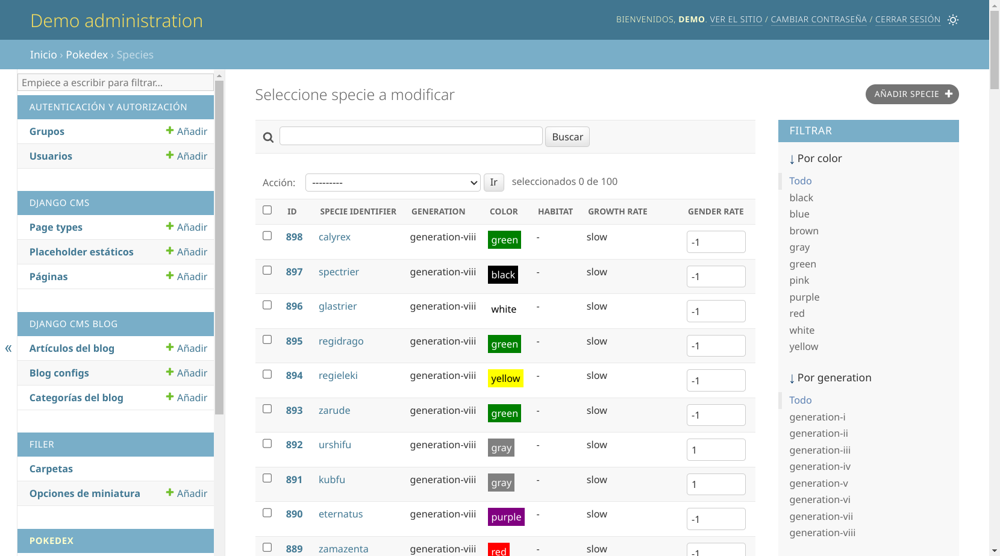
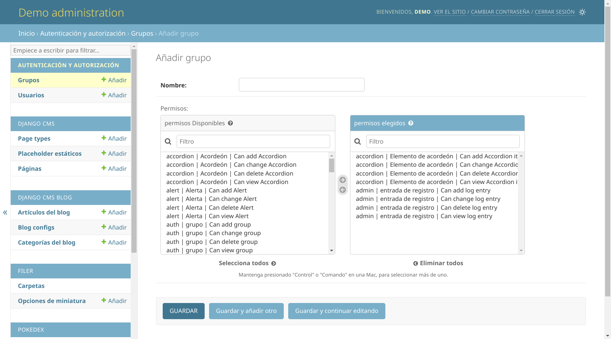
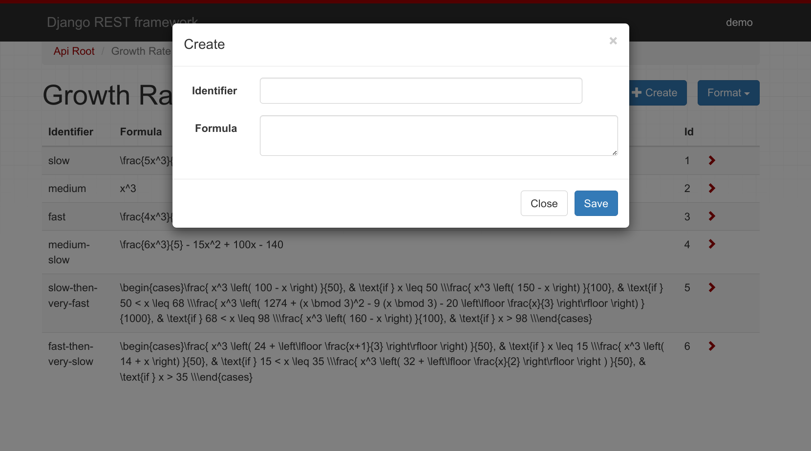
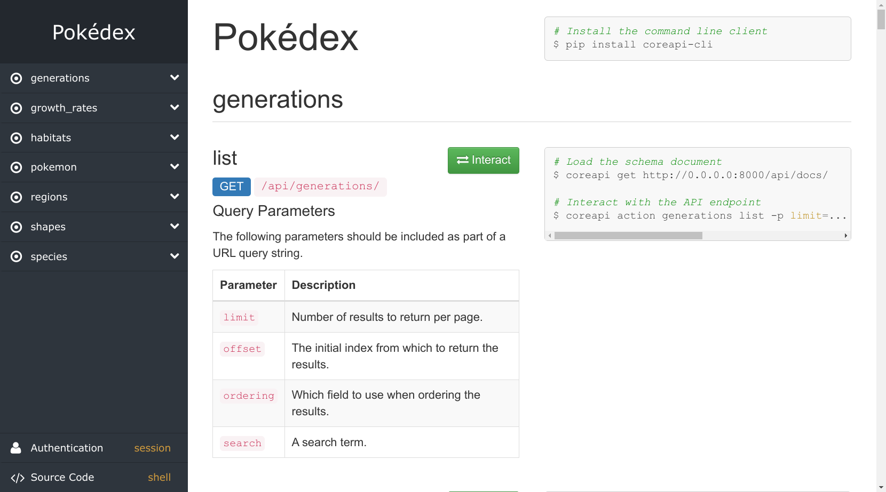
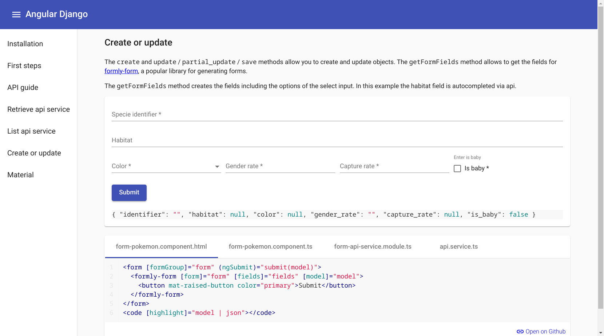

.. toctree::
   :glob:
   :hidden:

   *

.. _intro:

###################################
**Angular** y **Django** de la mano
###################################

.. revealjs-section::
    :data-background-gradient: linear-gradient(-45deg, #0C4B33, #44B78B, #7A03FE, #EF0812);

.. image:: images/angular-logo.*
  :width: 500

y

.. image:: images/django-logo.*
  :width: 330

de la mano

.. revealjs-notes::

  Hola a todos.

👋
==

.. revealjs-section::
    :data-background-color: #4973ff
    :data-transition-speed: slow
    :data-transition: fade

.. revealjs-notes::

  Quiero dar gracias por estar aquí, y a vosotros por venir. Tengo ya experiencia en esto de dar charlas, pero nunca
  había dado una charla aquí, y aún menos a un grupo de Angular. Por ello, me presento por si acaso...

Sobre mí **Nekmo**
==================

.. revealjs-section::
    :data-background-color: #333333
    :data-transition-speed: default
    :data-transition: fade

+------------------------------------+
|                                    |
| .. image:: images/cara.svg         |
|   :width: 200px                    |
|                                    |
| *Programador Python*               |
|                                    |
+------------------------------------+

.. revealjs-notes::

  Soy Juan José, más conocido en redes como Nekmo, y tal vez me conozcáis de charlas sobre Python...

Python **Málaga**
=================

.. revealjs-section::
    :data-background-color: #4973ff
    :data-transition-speed: default
    :data-transition: fade

.. image:: images/python-malaga-logo.*
   :width: 200

.. revealjs-notes::

   Es más, provengo de la asociación de Python Málaga, y me encuentro aquí un poco de incógnito.

Incógnito
=========

.. revealjs-section::
    :data-background-color: #333333
    :data-background-video: _static/incognito.mp4
    :data-background-video-loop: true
    :data-background-size: cover

.. revealjs-notes::

   Pero no os preocupéis, que también tengo experiencia con Angular, el cual llevo utilizando desde AngularJS.
   Es más, es el otro gran framework que utilizo, junto con Django...

Angular + Django
================

.. revealjs-section::
    :data-background-color: #f18fed
    :data-transition-speed: default
    :data-transition: fade

.. image:: images/angular-logo.*
  :width: 500

``+``

.. image:: images/django-logo.*
  :width: 330

.. revealjs-notes::

   Y si utilizo Angular además de Django, es porque son dos frameworks que se complementan muy bien.

Python
======

.. revealjs-section::
    :data-background-color: #333333
    :data-transition-speed: default
    :data-transition: fade

.. image:: images/python-logo.*
  :width: 400

.. revealjs-notes::

   Aunque antes de hablar de Django, tal vez os preguntéis... ¿Por qué Python? Si seguramente muchos ya programaréis en
   Typescript/Node.

Ventajas **Python**
===================

.. revealjs-section::
    :data-background-color: #333333
    :data-transition-speed: default
    :data-transition: fade

* **Fácil** de aprender y sintaxis legible.
* Gran **popularidad** y comunidad.
* Potente en **análisis de datos**, **machine learning** y más.
* Con **pilas incluidas**.
* **Paquetes** para todo y con gran **soporte**... como **Django**.

.. revealjs-notes::

   Entre algunos de los motivos para aprender un lenguaje adicional, encontramos... (LEER LISTA)

Django
======

.. revealjs-section::
    :data-background-color: #0C4B33
    :data-transition-speed: default
    :data-transition: slide

.. image:: images/django-logo.*
     :width: 800

.. revealjs-notes::

   Tal vez a Python le sobren las presentaciones, pero Django no se queda atrás.

Angular
=======

.. revealjs-section::
    :data-background-color: #7A03FD
    :data-transition-speed: default
    :data-transition: slide

.. image:: images/angular-logo.*
     :width: 1000

.. revealjs-notes::

   Es más, si me gusta Angular, seguramente sea por todo lo que comparte con Django en cuanto a filosofía. Es por ello
   que estoy convencido, que si os gusta Angular, os gustará Django.

**Filosofía** común
===================

.. revealjs-section::
    :data-background-color: #0C4B33
    :data-transition-speed: default
    :data-transition: slide

.. revealjs-notes::

   Django, al igual que Angular, viene incluido con todo lo necesario para trabajar. Sin necesidad de paquetes de
   terceros, y con una estructura y metodología de trabajo clara y definida.

El framework web para **perfeccionistas** con plazos de **entrega**
-------------------------------------------------------------------

.. revealjs-section::
    :data-background-color: #0C4B33
    :data-transition-speed: default
    :data-transition: slide

.. revealjs-notes::

   Tal y como dice su eslogan, Django es un framework web para perfeccionistas con plazos de entrega. Y es que Django
   no sólo trae de todo, sino que permite trabajar de forma rápida y eficiente, gracias a su estructura y metodología.

Características
===============

.. revealjs-section::
    :data-background-color: #0C4B33
    :data-transition-speed: default
    :data-transition: slide

.. revealjs-fragments::

    * **ORM** para base de datos.
    * Panel de **administración**.
    * Sistema de **usuarios**, **permisos** y **sesiones**.
    * Gestión de **rutas** y **vistas**.
    * **Middleware**.
    * **Caché**.
    * Envío de **correos**...

.. revealjs-notes::

    Entre las características de Django, encontramos... (LEER LISTA)

ORM
---

.. revealjs-section::
    :data-background-color: #0C4B33
    :data-transition-speed: default
    :data-transition: slide

.. code-block:: python

    # models.py
    # ---------
    class Specie(models.Model):
        identifier = models.CharField(_('Specie identifier'),
                                      max_length=50)
        color = models.CharField(max_length=8, choices=COLORS)
        gender_rate = models.SmallIntegerField()
        has_gender_differences = models.BooleanField()

.. revealjs-notes::

   Y entre todas ellas, tal vez mi favorita sea el ORM. Creedme cuando os digo que es una maravilla. Es el más
   fácil de usar y potente que he probado. Con un sistema de migraciones que os hará la vida más fácil. Con múltiples
   motores de base de datos soportados.

**Administración**
------------------

.. revealjs-section::
    :data-background-color: #0C4B33
    :data-transition-speed: default
    :data-transition: slide

.. revealjs-notes::

   Pero su admin no se queda atrás. El panel de administración de Django se autoconstruye a partir de los modelos que
   se definan, siendo muy fáciles de personalizar y extender. Resulta un gran apoyo para trabajar con los datos de la
   aplicación, con un esfuerzo mínimo.

Usuarios y **permisos**
-----------------------

.. revealjs-section::
    :data-background-color: #0C4B33
    :data-transition-speed: default
    :data-transition: slide

.. revealjs-notes::

   Incluso nos viene ya con un sistema de usuarios, permisos, autenticación, sesiones... Todo lo necesario para empezar
   a crear una aplicación web. Extensible y personalizable, por supuesto. Y sobre todo, estandarizado, al igual que
   en Angular.

¿Cómo pueden trabajar **juntos**?
=================================

.. revealjs-section::
    :data-background-gradient: linear-gradient(-45deg, #0C4B33, #44B78B, #7A03FE, #EF0812);

.. revealjs-notes::

   Pero, ¿cómo podemos hacer que ambos se comuniquen?

proxy.conf.json
---------------

.. revealjs-section::
    :data-background-color: #7A03FD
    :data-transition-speed: default
    :data-transition: slide

.. code-block:: json

    {
      "/api": {
        "target": "http://localhost:8000",
        "secure": false
      }
    }

.. revealjs-notes::

    Es tan sencillo como configurar un proxy en Angular, para que todas las peticiones a la ruta ``/api`` sean
    redirigidas a Django. Pero... ¿cómo responderá Django?

Django Rest **Framework**
=========================

.. revealjs-section::
    :data-background-color: #0C4B33
    :data-transition-speed: default
    :data-transition: slide

.. revealjs-notes::

    Aunque antes hemos dicho que Django viene con todo, para disponer de una API REST disponemos de Django Rest
    Framework, una biblioteca que es de facto el estándar para crear APIs REST en Django.

Ejemplo web
-----------

.. revealjs-section::
    :data-background-color: #0C4B33
    :data-transition-speed: default
    :data-transition: slide

.. image:: images/api-web-list.png

.. revealjs-notes::

   Seguramente hayáis visto muchas APIs REST, pero no creo que muchas tan vistosas como la de Django Rest Framework,
   la cual nos viene de serie así.

**Formulario**
--------------

.. revealjs-section::
    :data-background-color: #0C4B33
    :data-transition-speed: default
    :data-transition: slide

.. revealjs-notes::

   Incluso nos ofrece una vista de edición con un formulario, para utilizar la API como si fuese un panel de
   administración y de pruebas. Un panel que podemos personalizar.

**Swagger**
-----------

.. revealjs-section::
    :data-background-color: #0C4B33
    :data-transition-speed: default
    :data-transition: slide

.. image:: images/api-web-swagger.png

.. revealjs-notes::

   Por supuesto, también nos ofrece un Swagger, el cual se autoconstruye...

API **Doc**
-----------

.. revealjs-section::
    :data-background-color: #0C4B33
    :data-transition-speed: default
    :data-transition: slide

.. revealjs-notes::

   ... y una documentación. De serie.

Características
---------------

.. revealjs-section::
    :data-background-color: #0C4B33
    :data-transition-speed: default
    :data-transition: slide

.. revealjs-fragments::

    * **Interpretar** y **renderizar** a múltiples formatos.
    * **Clases genéricas** para facilitar operaciones **CRUD**.
    * Potentes **serializers** para trabajar **con o sin** el **ORM**.
    * **Paginación**, **filtrado**, **búsqueda** y **ordenación** en listados.
    * Compatible con los **validadores** y **sistema de permisos** de Django.
    * ... entre **otras opciones**.

.. revealjs-notes::

   Pero esto no es todo lo que Django Rest Framework ofrece. Entre sus características, encontramos... (LEER LISTA)

Cómo se **divide**
------------------

.. revealjs-section::
    :data-background-color: #0C4B33
    :data-transition-speed: default
    :data-transition: slide

.. revealjs-fragments::

    * **Serializers**: representan e interpretan los datos.
    * **Viewsets**: gestionan las peticiones y devuelven la respuesta.
    * **Routers**: corresponde a las urls que se utilizarán.

.. revealjs-notes::

   Y al igual que Angular, que se divide en módulos, componentes y rutas, Django Rest Framework tiene su propia
   forma de dividirse. Entre sus partes, encontramos... (LEER LISTA). Como veis, estos dos últimos puntos son muy
   similares a Angular. Vamos a verlos un poco más en detalle...

**Serializers**
---------------

.. revealjs-section::
    :data-background-color: #0C4B33
    :data-transition-speed: default
    :data-transition: slide

.. revealjs-code-block:: python
   :data-line-numbers: 1-7|6|7|

    # serializers.py
    # --------------
    class SpecieSerializer(serializers.HyperlinkedModelSerializer):

        class Meta:
            model = Specie
            exclude = ()

.. revealjs-notes::

    Los Serializers son los encargados de representar e interpretar los datos. (1) En este caso, estamos creando un
    Serializer para el modelo ``Specie``, y no nos es necesario definir los campos, ya que se autoconstruye a partir
    del modelo. (2) Pero si queremos, podemos personalizarlo.

Serializer **personalizado**
----------------------------

.. revealjs-section::
    :data-background-color: #0C4B33
    :data-transition-speed: default
    :data-transition: slide

.. revealjs-code-block:: python
   :data-line-numbers: 1-12|5-8|

    # serializers.py
    # --------------
    class SpecieSerializer(serializers.HyperlinkedModelSerializer):

        identifier = serializers.CharField()
        color = serializers.ChoiceField(choices=COLORS)
        gender_rate = serializers.IntegerField()
        has_gender_differences = serializers.BooleanField(default=False)

        class Meta:
            model = Specie
            exclude = ()

.. revealjs-notes::

    Ya en este ejemplo, (1) estamos personalizando el Serializer, pudiendo añadir campos que no existan en el modelo,
    o cambiar el tipo de campo, sus validaciones, etc.

**Viewsets**
------------

.. revealjs-section::
    :data-background-color: #0C4B33
    :data-transition-speed: default
    :data-transition: slide

.. revealjs-code-block:: python
   :data-line-numbers: 1-13|4-7|9-13|

    class SpecieViewSet(viewsets.ViewSet):
        """A simple ViewSet for listing or retrieving species."""

        def list(self, request):
            queryset = Specie.objects.all()
            serializer = SpecieSerializer(queryset, many=True)
            return Response(serializer.data)

        def retrieve(self, request, pk=None):
            queryset = Specie.objects.all()
            user = get_object_or_404(queryset, pk=pk)
            serializer = SpecieSerializer(user)
            return Response(serializer.data)

.. revealjs-notes::

   Tal y como hemos dicho antes, los Viewsets son los encargados de gestionar las peticiones y devolver la respuesta.
   (1) En este caso, estamos utilizando el serializer anterior para devolver un listado y (2) el detalle de uno de
   ellos...

**ModelViewSet**
----------------

.. revealjs-section::
    :data-background-color: #0C4B33
    :data-transition-speed: default
    :data-transition: slide

.. revealjs-code-block:: python
   :data-line-numbers: 1-22|1|1-7|17-22|11-15|

    class SpecieViewSet(viewsets.ModelViewSet):
        """
        This viewset automatically provides `list`, `create`, `retrieve`,
        `update` and `destroy` actions.

        Additionally we also provide an extra `photo` action.
        """
        queryset = Specie.objects.select_related('growth_rate', 'shape',
                                                 'habitat')
        serializer_class = SimpleSpecieSerializer
        filter_class = SpecieFilter
        ordering_fields = ('identifier', 'generation', 'evolves_from_specie',
                           'color')
        search_fields = ('identifier', 'generation__identifier',
                         'shape__identifier')

        @action(detail=True)
        def photo(self, *args, **kwargs):
            obj = self.get_object()
            photo_url = PHOTO_FORMAT_URL.format(**vars(obj))
            return Response(headers={'Location': photo_url},
                            status=status.HTTP_302_FOUND)

.. revealjs-notes::

   Pero con Django Rest Framework ni siquiera es necesario definir dichos métodos básicos. (1) Usando un ModelViewSet,
   (2) ya tenemos todos los métodos CRUD disponibles, (3) y podemos añadir métodos adicionales, como en este caso, un
   método para devolver una imagen. (4) Podemos personalizar además los listados añadiendo filtros, ordenación,
   búsqueda...

**Routers**
-----------

.. revealjs-section::
    :data-background-color: #0C4B33
    :data-transition-speed: default
    :data-transition: slide

.. code-block:: python

    # routers.py
    # ----------

    router = DefaultRouter()
    router.register(r'pokemon', viewsets.PokemonViewSet)
    router.register(r'species', viewsets.SpecieViewSet)
    router.register(r'growth_rates', viewsets.GrowthRateViewSet)
    router.register(r'shapes', viewsets.ShapeViewSet)
    router.register(r'habitats', viewsets.HabitatViewSet)
    router.register(r'generations', viewsets.GenerationViewSet)
    router.register(r'regions', viewsets.RegionViewSet)

.. revealjs-notes::

   Y finalmente los routers, los cuales no son muy diferentes a los routers de Angular.

¿Cómo usamos nuestra **API** en **Angular**?
============================================

.. revealjs-section::
    :data-background-color: #7A03FD
    :data-transition-speed: default
    :data-transition: slide

.. revealjs-notes::

    Vale, ya hemos visto nuestra API REST en Django, y hemos dicho cómo conectar ambos mundos a través de los proxies de
    Angular. Pero... ¿cómo trabajamos con la API en Angular?

**Interfaces** en Angular
=========================

.. revealjs-section::
    :data-background-color: #7A03FD
    :data-transition-speed: default
    :data-transition: slide

.. code-block:: typescript

    export interface Specie {
        url: string;
        identifier: string;
        color: string;
        gender_rate: number;
        has_gender_differences: boolean;
    }

.. revealjs-notes::

   Lo primero, y aunque no es obligatorio, recomiendo definir las interfaces con lo que nos vendrá de nuestra API. Es el equivalente a los Serializers de Django Rest Framework.

**Servicios** de Angular
========================

.. revealjs-section::
    :data-background-color: #7A03FD
    :data-transition-speed: default
    :data-transition: slide

.. code-block:: typescript

    @Injectable({
        providedIn: 'root'
    })
    export class SpecieService {
        private readonly url = '/api/species/';

        constructor(private http: HttpClient) {}

        list(): Observable<Specie[]> {
            return this.http.get<Specie[]>(this.url);
        }
    }

.. revealjs-notes::

   Y aunque podríamos utilizar directamente el HttpClient en los componentes, recomiendo encapsularlo en servicios, para poder reutilizarlo y testearlo más fácilmente.

Angular-django
==============

.. revealjs-section::
    :data-background-gradient: linear-gradient(-45deg, #0C4B33, #44B78B, #7A03FE, #EF0812);

.. image:: images/angular-django.png

.. revealjs-notes::

   Para facilitar este trabajo, tengo creada una biblioteca encargada de generar automáticamente los servicios y las
   interfaces de Angular a partir de los Serializers de Django Rest Framework. No obstante, ésta se encuentra en una
   fase temprana de desarrollo y desactualizada en estos momentos. Pero si recibo suficiente interés, priorizaré su
   desarrollo.

Angular-django **forms**
------------------------

.. revealjs-section::
    :data-background-gradient: linear-gradient(-45deg, #0C4B33, #44B78B, #7A03FE, #EF0812);

.. revealjs-notes::

   Incluso nos viene con generación automática de formularios para Material, con validaciones y mensajes de error.

Angular-django **tables**
-------------------------

.. revealjs-section::
    :data-background-gradient: linear-gradient(-45deg, #0C4B33, #44B78B, #7A03FE, #EF0812);

.. image:: images/angular-django-tables.png

.. revealjs-notes::

   Y también con generación automática de tablas para Material, con paginación, ordenación y búsqueda.

Demo
----

.. revealjs-section::
    :data-background-color: #333333
    :data-background-video: _static/demo.mp4
    :data-background-video-loop: true
    :data-background-size: cover

.. revealjs-notes::

   Pero mejor, vamos a verlo con una demostración en directo.

¿**Dónde** se encuentra?
------------------------

.. revealjs-section::
    :data-background-gradient: linear-gradient(-45deg, #0C4B33, #44B78B, #7A03FE, #EF0812);

`🌐 angular-django.nekmo.org <https://angular-django.nekmo.org/>`_

.. revealjs-notes::

   Y si queréis volver a ver y probar por vosotros mismos esta demo, se encuentra disponible online en mi sitio web.

¿Y esta **presentación**?
=========================

.. revealjs-section::
    :data-background-color: #333333
    :data-transition-speed: default
    :data-transition: fade

`🌐 github:Nekmo/angular-django-presentacion <https://github.com/Nekmo/angular-django-presentacion>`_

.. revealjs-notes::

   Y si lo que queréis es ver esta presentación, junto con su código fuente, también se encuentra disponible en GitHub.

Código QR
---------

.. revealjs-section::
    :data-background-color: #4973ff
    :data-transition-speed: default
    :data-transition: none

.. image:: images/qr.svg
   :alt: QR
   :width: 600px
   :align: center

.. revealjs-notes::

    Por si os es más fácil, aquí también la tenéis disponible, como un código QR.

¡Muchas gracias a todos!
========================

.. revealjs-section::
    :data-background-gradient: linear-gradient(-45deg, #0C4B33, #44B78B, #7A03FE, #EF0812);

.. revealjs-notes::

    ¡Muchas gracias a todos por llegar hasta aquí!

Contactar
---------

.. revealjs-section::
    :data-background-color: #333333
    :data-transition: none
    :data-transition-speed: slow

* 🌐 **Sitio web:** `nekmo.com <https://nekmo.com>`_
* 📫 **Email:** `contacto@nekmo.com <mailto:contacto@nekmo.com>`_
* 🐦 **Twitter:** `@nekmocom <https://twitter.com/nekmocom>`_
* 📱 **Telegram:** `@nekmo <https://t.me/nekmo>`_
* 💡 **Jabber:** `nekmo@nekmo.org <xmpp://nekmo@nekmo.org>`_

.. revealjs-notes::

   Y también, si tenéis alguna duda, aquí tenéis mis formas de contacto.
